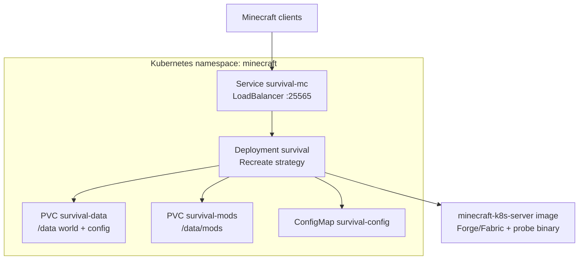

# Minecraft on Kubernetes (Modded)

Run a **modded Minecraft server** (Forge, Fabric, or Quilt) on Kubernetes with persistent world data, a dedicated mods volume, Docker-based tooling, and a Rust CLI for validation and manifest generation.

All development, testing, and builds run **inside Docker** — nothing is installed on the host except Docker and Git.

## Features

- **Mod support** via [itzg/minecraft-server](https://hub.docker.com/r/itzg/minecraft-server) (`TYPE=FORGE|FABRIC|QUILT`)
- **Kubernetes manifests** for namespace, PVCs (world + mods), Deployment, Service, ConfigMap
- **Rust CLI** (`minecraft-k8s`) for config validation, manifest rendering, health probes, and mod JAR checks
- **100% line coverage** on library/CLI code (enforced in CI via `cargo-tarpaulin`)
- **GitHub Actions** for tests, manifest validation, and container image builds

## Repository layout

```
.
├── config/server.toml      # Example server configuration
├── crates/minecraft-k8s/   # Rust library + CLI
├── docker/                 # Dockerfiles and docker-compose
├── k8s/                    # Kubernetes manifests (ready to apply)
├── mods/                   # Local mod JARs for docker-compose testing
├── scripts/                # Docker-wrapped helper scripts
└── .github/workflows/      # CI and release pipelines
```

## Quick start (Kubernetes)

### Prerequisites

- A Kubernetes cluster (1.24+)
- `kubectl` configured
- Storage class that supports `ReadWriteOnce` PVCs
- Docker (for building images locally, optional if using GHCR images)

### 1. Build or pull images

**From GitHub Container Registry** (after CI publishes):

```bash
docker pull ghcr.io/brianlechthaler/minecraft-k8s-server:latest
docker pull ghcr.io/brianlechthaler/minecraft-k8s-tools:latest
```

**Build locally** (everything runs in Docker):

```bash
./scripts/build.sh
```

### 2. Deploy to Kubernetes

```bash
kubectl apply -k k8s/
```

Or render manifests from your own config:

```bash
./scripts/render-manifests.sh config/server.toml k8s/generated/manifests.yaml
kubectl apply -f k8s/generated/manifests.yaml
```

### 3. Add mods

Copy mod JARs into the mods PVC after the pod is running:

```bash
POD=$(kubectl -n minecraft get pod -l app.kubernetes.io/name=survival -o jsonpath='{.items[0].metadata.name}')
kubectl -n minecraft cp ./mods/. "$POD:/data/mods/"
kubectl -n minecraft rollout restart deployment/survival
```

### 4. Connect to the server

```bash
kubectl -n minecraft get svc survival-mc
```

Use the `EXTERNAL-IP` (LoadBalancer) or port-forward:

```bash
kubectl -n minecraft port-forward svc/survival-mc 25565:25565
```

Connect in Minecraft to `localhost:25565`.

## Configuration

Edit `config/server.toml`:

| Field | Description |
|-------|-------------|
| `name` | Kubernetes resource name |
| `namespace` | Target namespace |
| `minecraft_version` | Minecraft version (e.g. `1.20.1`) |
| `mod_loader` | `forge`, `fabric`, `quilt`, `paper`, or `vanilla` |
| `forge_version` | Required when `mod_loader = "forge"` |
| `memory` | JVM heap limit (e.g. `4G`) |
| `eula` | Must be `true` (Mojang EULA) |
| `modpack_url` | Optional remote modpack URL |
| `extra_env` | Additional container environment variables |

Validate configuration:

```bash
./scripts/validate-manifests.sh   # validates committed k8s/manifests.yaml
docker build -f docker/Dockerfile.rust -t minecraft-k8s-tools:local .
docker run --rm -v "$(pwd):/src" -w /src minecraft-k8s-tools:local \
  validate --config /src/config/server.toml --mods-dir /src/mods
```

## Local testing with Docker Compose

```bash
cd docker
docker compose up --build minecraft
```

Place mod JARs in `mods/` before starting. The server uses Forge 1.20.1 by default with `ONLINE_MODE=FALSE` for local testing.

## Rust CLI

The `minecraft-k8s` binary is built inside Docker and embedded in the server image for Kubernetes probes.

| Command | Purpose |
|---------|---------|
| `validate --config <toml> [--mods-dir <dir>]` | Validate server config and optional mod JARs |
| `render --config <toml> [--output <yaml>]` | Generate Kubernetes manifests |
| `check-manifests --path <yaml>` | Validate manifest YAML structure |
| `probe --port 25565` | TCP health check (used by K8s probes) |
| `write-eula --output <path>` | Write accepted `eula.txt` |

### Running tests (Docker only)

```bash
./scripts/test.sh
```

This runs all unit/integration tests and enforces **100% line coverage** on `src/` (excluding `main.rs` and integration test files).

## Kubernetes architecture



**Design decisions:**

- **Single replica** with `Recreate` strategy — Minecraft servers are stateful; only one pod may mount the world PVC at a time.
- **Separate mods PVC** — mods can be updated independently and re-synced on restart.
- **TCP probes** — readiness/liveness use the Rust `probe` command against port 25565.
- **Non-root** — container runs as UID 1000 with `fsGroup` 1000.

## Mod loaders

| Loader | `TYPE` env | Mods directory | Notes |
|--------|------------|----------------|-------|
| Forge | `FORGE` | `/data/mods` | Set `forge_version` in config |
| Fabric | `FABRIC` | `/data/mods` | Use `extra_env` for loader/API versions |
| Quilt | `QUILT` | `/data/mods` | Similar to Fabric |
| Paper | `PAPER` | plugins dir | Plugins, not Forge mods |
| Vanilla | `VANILLA` | — | No mod support |

The container image inherits environment-variable semantics from [itzg/minecraft-server](https://github.com/itzg/docker-minecraft-server/blob/master/docs/types-and-platforms.md).

## CI/CD

### `.github/workflows/ci.yml`

Runs on every push and pull request to `main`:

| Job | What it does |
|-----|----------------|
| **rust-tests** | Runs `cargo test` (unit + integration) in Docker; enforces 100% line coverage via `cargo-tarpaulin` |
| **manifest-validation** | Verifies `k8s/manifests.yaml`, `config/server.toml`, and rendered output all reference `ghcr.io/brianlechthaler/minecraft-k8s-server`; validates YAML structure |
| **docker-build** | Builds server and tools images locally; smoke-tests the CLI binaries |
| **publish-ghcr** | *(push to `main` only)* Builds, pushes, and sets **public** visibility on GHCR images |

Published container images (public on GHCR):

- `ghcr.io/brianlechthaler/minecraft-k8s-server:latest` (and `:sha-…` per commit)
- `ghcr.io/brianlechthaler/minecraft-k8s-tools:latest` (and `:sha-…` per commit)

Kubernetes manifests in `k8s/manifests.yaml` and `config/server.toml` already point at the GHCR server image.

## Security notes

- Change the default RCON password in production (`RCON_PASSWORD` in manifests or config).
- Set `online-mode=true` in production (default in generated manifests).
- Do not commit world data, secrets, or mod JARs you do not have rights to redistribute.
- The EULA must be accepted (`eula = true` in config, `EULA=TRUE` in container).

## Troubleshooting

| Symptom | Check |
|---------|-------|
| Pod stuck `Pending` | PVC storage class / capacity |
| Pod `CrashLoopBackOff` | `kubectl logs -n minecraft deployment/survival` — often EULA, memory, or Forge version mismatch |
| Mods not loading | JARs in `/data/mods`, compatible loader + MC version |
| Cannot connect | Service external IP, firewall UDP/TCP 25565, probe timing (server takes 1–3 min to start) |

Logs:

```bash
kubectl -n minecraft logs -f deployment/survival
```

## Publishing

The repository is initialized locally on branch `main`. To publish to GitHub:

```bash
# Requires a GitHub personal access token with repo scope
GH_TOKEN=<your-token> ./scripts/publish.sh
```

Alternatively, create an empty public repository at [github.com/new](https://github.com/new?name=minecraft-k8s) named `minecraft-k8s`, then push via SSH:

```bash
git push -u origin main
```

Remote URL: `git@github.com:brianlechthaler/minecraft-k8s.git`

## License

MIT — Minecraft is a trademark of Mojang/Microsoft. Mods are subject to their respective licenses.
